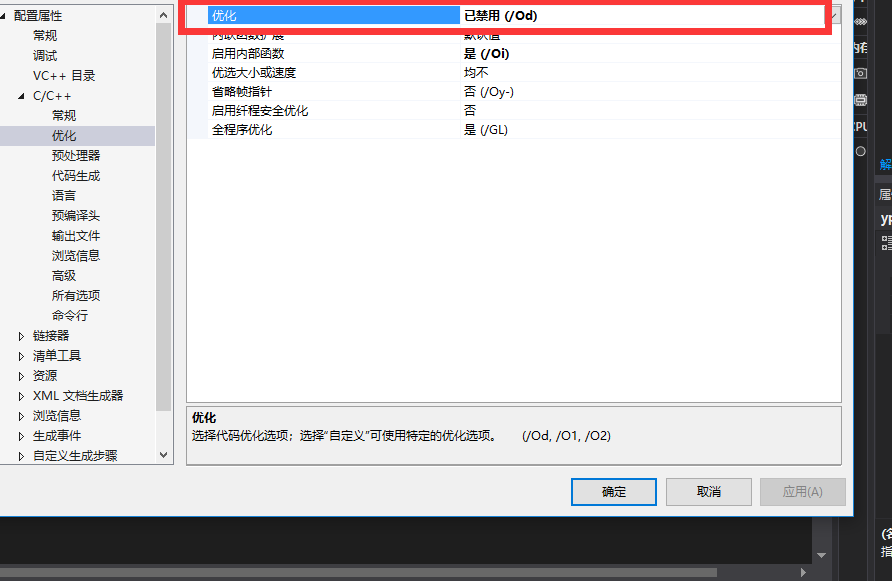
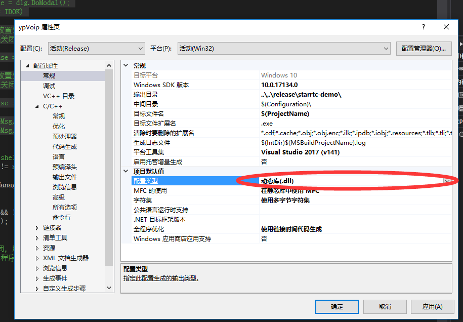

starrtc c# 由于时间原因,本人只是完成了对一对一视频的集成更改,相信有了这个案例,可以让大家迅速集成其c#版本的其他功能
====================================================================================================
	#1.首先将c++源代码CVoipDlg.h 改成了对应的YPVoip.h,基本99%的代码不需要更改,大家可以直接参考
	#2.利用dllexport 关键字开放几个函数给c#调用,分别是YPLogin(登录),VoipCallPerson(呼叫),DeleteVoip(释放资源)
	#3.注释相关无用代码 入口处starrtcdemo.cpp文件里面注释以下代码,并将retrun FALSE改为return TRUE
  	//CStarRTCMenuDialog dlg;
	//m_pMainWnd = &dlg;
	//INT_PTR nResponse = dlg.DoModal();
	//if (nResponse == IDOK)
	//{
	//	// TODO: 在此放置处理何时用
	//	//  “确定”来关闭对话框的代码
	//}
	//else if (nResponse == IDCANCEL)
	//{
	//	// TODO: 在此放置处理何时用
	//	//  “取消”来关闭对话框的代码
	//}
	//else if (nResponse == -1)
	//{
	//	TRACE(traceAppMsg, 0, "警告: 对话框创建失败，应用程序将意外终止。\n");
	//	TRACE(traceAppMsg, 0, "警告: 如果您在对话框上使用 MFC 控件，则无法 #define _AFX_NO_MFC_CONTROLS_IN_DIALOGS。\n");
	//}
	#4.配置属性 将项目默认值->配置类型 改为动态库(dll)
	#5.c/c++ 里面的优化改为 已禁用 (/Od) 否则c#无法初始化类
##c++新增两个代码文件  
  
##c++项目设置1 

##c++项目设置2

##csharpe调用示例

